},
        features: {
            devTools: false,
            mockData: false,
            debugLogging: false
        }
    },

    production: {
        api: {
            baseUrl: 'https://api.rc-construcoes.com',
            timeout: 5000,
            retries: 3
        },
        database: {
            name: 'rc_construcoes_prod',
            version: 5,
            debugMode: false
        },
        features: {
            devTools: false,
            mockData: false,
            debugLogging: false
        },
        monitoring: {
            enabled: true,
            errorTracking: true,
            analytics: true,
            performanceMonitoring: true
        }
    }
};

// Environment Detection
class EnvironmentManager {
    static getCurrentEnvironment() {
        const hostname = window.location.hostname;
        
        if (hostname === 'localhost' || hostname === '127.0.0.1') {
            return 'development';
        } else if (hostname.includes('staging')) {
            return 'staging';
        } else {
            return 'production';
        }
    }

    static getConfig() {
        const env = this.getCurrentEnvironment();
        return EnvironmentConfig[env];
    }
}
```

## 🔧 Extension Architecture

### 1. Plugin System

#### Modular Extension Framework
```javascript
// Plugin Architecture
class PluginManager {
    constructor() {
        this.plugins = new Map();
        this.hooks = new Map();
    }

    // Register a plugin
    registerPlugin(name, plugin) {
        if (this.validatePlugin(plugin)) {
            this.plugins.set(name, plugin);
            this.executeHook('plugin:registered', { name, plugin });
            return true;
        }
        return false;
    }

    // Plugin validation
    validatePlugin(plugin) {
        return (
            typeof plugin.name === 'string' &&
            typeof plugin.version === 'string' &&
            typeof plugin.init === 'function'
        );
    }

    // Hook system for extensibility
    addHook(event, callback) {
        if (!this.hooks.has(event)) {
            this.hooks.set(event, []);
        }
        this.hooks.get(event).push(callback);
    }

    executeHook(event, data = {}) {
        if (this.hooks.has(event)) {
            this.hooks.get(event).forEach(callback => {
                try {
                    callback(data);
                } catch (error) {
                    console.error(`Hook execution failed for ${event}:`, error);
                }
            });
        }
    }

    // Initialize all plugins
    async initializePlugins() {
        for (const [name, plugin] of this.plugins) {
            try {
                await plugin.init(this.getPluginContext());
                console.log(`Plugin ${name} initialized successfully`);
            } catch (error) {
                console.error(`Failed to initialize plugin ${name}:`, error);
            }
        }
    }

    getPluginContext() {
        return {
            database: window.Database,
            auth: window.Auth,
            utils: window.Utils,
            addHook: this.addHook.bind(this),
            executeHook: this.executeHook.bind(this)
        };
    }
}

// Example Plugin
const ExamplePlugin = {
    name: 'ExamplePlugin',
    version: '1.0.0',
    description: 'An example plugin for RC Construções',

    async init(context) {
        // Plugin initialization logic
        context.addHook('client:created', this.onClientCreated);
        context.addHook('contract:signed', this.onContractSigned);
    },

    onClientCreated(data) {
        console.log('New client created:', data.client);
        // Custom logic for client creation
    },

    onContractSigned(data) {
        console.log('Contract signed:', data.contract);
        // Custom logic for contract signing
    }
};

// Usage
const pluginManager = new PluginManager();
pluginManager.registerPlugin('example', ExamplePlugin);
```

### 2. API Integration Architecture

#### External API Framework
```javascript
// API Integration Framework
class APIIntegrationManager {
    constructor() {
        this.integrations = new Map();
        this.middleware = [];
    }

    // Register external API integration
    registerIntegration(name, config) {
        const integration = new APIIntegration(config);
        this.integrations.set(name, integration);
        return integration;
    }

    // Add middleware for all API calls
    addMiddleware(middleware) {
        this.middleware.push(middleware);
    }

    // Get specific integration
    getIntegration(name) {
        return this.integrations.get(name);
    }
}

class APIIntegration {
    constructor(config) {
        this.baseUrl = config.baseUrl;
        this.apiKey = config.apiKey;
        this.timeout = config.timeout || 5000;
        this.retries = config.retries || 3;
        this.rateLimiter = new RateLimiter(config.rateLimit);
    }

    async request(method, endpoint, data = null) {
        const url = `${this.baseUrl}${endpoint}`;
        const options = {
            method,
            headers: this.buildHeaders(),
            body: data ? JSON.stringify(data) : null
        };

        return this.executeWithRetry(() => this.fetch(url, options));
    }

    buildHeaders() {
        return {
            'Content-Type': 'application/json',
            'Authorization': `Bearer ${this.apiKey}`,
            'User-Agent': 'RC-Construcoes/1.0'
        };
    }

    async executeWithRetry(operation) {
        let lastError;
        
        for (let attempt = 1; attempt <= this.retries; attempt++) {
            try {
                await this.rateLimiter.checkLimit();
                return await operation();
            } catch (error) {
                lastError = error;
                if (attempt < this.retries && this.isRetryableError(error)) {
                    await this.delay(Math.pow(2, attempt) * 1000); // Exponential backoff
                    continue;
                }
                break;
            }
        }
        
        throw lastError;
    }

    isRetryableError(error) {
        return (
            error.name === 'NetworkError' ||
            (error.status >= 500 && error.status < 600) ||
            error.status === 429 // Rate limit
        );
    }

    delay(ms) {
        return new Promise(resolve => setTimeout(resolve, ms));
    }
}

// Rate Limiter
class RateLimiter {
    constructor(config = {}) {
        this.maxRequests = config.maxRequests || 100;
        this.timeWindow = config.timeWindow || 60000; // 1 minute
        this.requests = [];
    }

    async checkLimit() {
        const now = Date.now();
        
        // Remove old requests outside time window
        this.requests = this.requests.filter(
            timestamp => now - timestamp < this.timeWindow
        );

        if (this.requests.length >= this.maxRequests) {
            const oldestRequest = Math.min(...this.requests);
            const waitTime = this.timeWindow - (now - oldestRequest);
            throw new Error(`Rate limit exceeded. Wait ${waitTime}ms`);
        }

        this.requests.push(now);
    }
}
```

## 📋 Design Patterns

### 1. Creational Patterns

#### Singleton Pattern
```javascript
// Singleton Pattern for Global Managers
class DatabaseManager {
    constructor() {
        if (DatabaseManager.instance) {
            return DatabaseManager.instance;
        }
        
        this.db = null;
        this.isConnected = false;
        DatabaseManager.instance = this;
    }

    static getInstance() {
        if (!DatabaseManager.instance) {
            DatabaseManager.instance = new DatabaseManager();
        }
        return DatabaseManager.instance;
    }
}

// Usage ensures single instance
const db1 = new DatabaseManager();
const db2 = DatabaseManager.getInstance();
console.log(db1 === db2); // true
```

#### Factory Pattern
```javascript
// Factory Pattern for Creating Business Objects
class EntityFactory {
    static create(type, data) {
        switch (type) {
            case 'client':
                return new Client(data);
            case 'contract':
                return new Contract(data);
            case 'budget':
                return new Budget(data);
            case 'supplier':
                return new Supplier(data);
            default:
                throw new Error(`Unknown entity type: ${type}`);
        }
    }

    static createFromDatabase(type, dbData) {
        const entity = this.create(type, dbData);
        entity.id = dbData.id;
        entity.createdAt = new Date(dbData.createdAt);
        entity.updatedAt = new Date(dbData.updatedAt);
        return entity;
    }
}

// Usage
const client = EntityFactory.create('client', {
    name: 'João Silva',
    cpf: '123.456.789-00'
});
```

### 2. Structural Patterns

#### Adapter Pattern
```javascript
// Adapter Pattern for External API Integration
class APIAdapter {
    constructor(externalAPI) {
        this.api = externalAPI;
    }

    // Adapt external API response to internal format
    async getClients() {
        const externalData = await this.api.fetchCustomers();
        
        return externalData.map(customer => ({
            id: customer.customer_id,
            name: customer.full_name,
            cpf: customer.tax_id,
            email: customer.email_address,
            phone: customer.phone_number,
            createdAt: new Date(customer.created_timestamp)
        }));
    }

    // Adapt internal format to external API format
    async createClient(internalClient) {
        const externalFormat = {
            full_name: internalClient.name,
            tax_id: internalClient.cpf,
            email_address: internalClient.email,
            phone_number: internalClient.phone
        };

        const response = await this.api.createCustomer(externalFormat);
        return this.adaptResponse(response);
    }
}
```

#### Decorator Pattern
```javascript
// Decorator Pattern for Adding Features to Components
class BaseComponent {
    render() {
        return '<div>Base Component</div>';
    }
}

class LoadingDecorator {
    constructor(component) {
        this.component = component;
        this.isLoading = false;
    }

    render() {
        if (this.isLoading) {
            return '<div class="loading">Loading...</div>';
        }
        return this.component.render();
    }

    setLoading(loading) {
        this.isLoading = loading;
    }
}

class ErrorDecorator {
    constructor(component) {
        this.component = component;
        this.error = null;
    }

    render() {
        if (this.error) {
            return `<div class="error">Error: ${this.error}</div>`;
        }
        return this.component.render();
    }

    setError(error) {
        this.error = error;
    }
}

// Usage
let component = new BaseComponent();
component = new LoadingDecorator(component);
component = new ErrorDecorator(component);
```

### 3. Behavioral Patterns

#### Observer Pattern
```javascript
// Observer Pattern for Event Management
class EventManager {
    constructor() {
        this.events = new Map();
    }

    subscribe(event, callback) {
        if (!this.events.has(event)) {
            this.events.set(event, []);
        }
        this.events.get(event).push(callback);
    }

    unsubscribe(event, callback) {
        if (this.events.has(event)) {
            const callbacks = this.events.get(event);
            const index = callbacks.indexOf(callback);
            if (index > -1) {
                callbacks.splice(index, 1);
            }
        }
    }

    emit(event, data) {
        if (this.events.has(event)) {
            this.events.get(event).forEach(callback => {
                try {
                    callback(data);
                } catch (error) {
                    console.error(`Error in event callback for ${event}:`, error);
                }
            });
        }
    }
}

// Global event manager
const EventBus = new EventManager();

// Usage
EventBus.subscribe('client:created', (client) => {
    console.log('New client created:', client);
    // Update UI, send notifications, etc.
});

EventBus.emit('client:created', { id: 1, name: 'João Silva' });
```

#### Command Pattern
```javascript
// Command Pattern for Undo/Redo Functionality
class Command {
    execute() {
        throw new Error('Execute method must be implemented');
    }

    undo() {
        throw new Error('Undo method must be implemented');
    }
}

class CreateClientCommand extends Command {
    constructor(clientData, clientsManager) {
        super();
        this.clientData = clientData;
        this.clientsManager = clientsManager;
        this.createdClient = null;
    }

    async execute() {
        this.createdClient = await this.clientsManager.create(this.clientData);
        return this.createdClient;
    }

    async undo() {
        if (this.createdClient) {
            await this.clientsManager.delete(this.createdClient.id);
        }
    }
}

class CommandManager {
    constructor() {
        this.history = [];
        this.currentIndex = -1;
    }

    async execute(command) {
        // Remove any commands after current index
        this.history = this.history.slice(0, this.currentIndex + 1);
        
        // Execute command
        const result = await command.execute();
        
        // Add to history
        this.history.push(command);
        this.currentIndex++;
        
        return result;
    }

    async undo() {
        if (this.currentIndex >= 0) {
            const command = this.history[this.currentIndex];
            await command.undo();
            this.currentIndex--;
        }
    }

    async redo() {
        if (this.currentIndex < this.history.length - 1) {
            this.currentIndex++;
            const command = this.history[this.currentIndex];
            await command.execute();
        }
    }
}
```

## 🔍 Monitoring Architecture

### 1. Performance Monitoring

#### Performance Metrics Collection
```javascript
// Performance Monitoring System
class PerformanceMonitor {
    constructor() {
        this.metrics = new Map();
        this.observers = [];
        this.isRecording = false;
    }

    startRecording() {
        this.isRecording = true;
        this.setupPerformanceObserver();
        this.setupUserTimingObserver();
        this.setupResourceObserver();
    }

    setupPerformanceObserver() {
        if ('PerformanceObserver' in window) {
            const observer = new PerformanceObserver((list) => {
                list.getEntries().forEach((entry) => {
                    this.recordMetric(entry.entryType, {
                        name: entry.name,
                        duration: entry.duration,
                        startTime: entry.startTime,
                        timestamp: Date.now()
                    });
                });
            });

            observer.observe({ entryTypes: ['navigation', 'resource', 'measure'] });
            this.observers.push(observer);
        }
    }

    recordMetric(type, data) {
        if (!this.metrics.has(type)) {
            this.metrics.set(type, []);
        }
        
        const metrics = this.metrics.get(type);
        metrics.push(data);
        
        // Keep only last 100 entries per type
        if (metrics.length > 100) {
            metrics.shift();
        }

        this.analyzeMetric(type, data);
    }

    analyzeMetric(type, data) {
        // Detect performance issues
        if (type === 'measure' && data.duration > 1000) {
            this.reportSlowOperation(data);
        }
        
        if (type === 'resource' && data.duration > 5000) {
            this.reportSlowResource(data);
        }
    }

    reportSlowOperation(data) {
        console.warn('Slow operation detected:', data);
        
        // Send to monitoring service
        if (window.Analytics) {
            window.Analytics.track('performance_issue', {
                type: 'slow_operation',
                operation: data.name,
                duration: data.duration
            });
        }
    }

    getMetrics(type) {
        return this.metrics.get(type) || [];
    }

    getPerformanceReport() {
        const report = {
            timestamp: Date.now(),
            navigation: this.getNavigationMetrics(),
            resources: this.getResourceMetrics(),
            userTiming: this.getUserTimingMetrics(),
            memory: this.getMemoryMetrics()
        };

        return report;
    }

    getNavigationMetrics() {
        const navigation = performance.getEntriesByType('navigation')[0];
        if (!navigation) return null;

        return {
            domContentLoaded: navigation.domContentLoadedEventEnd - navigation.domContentLoadedEventStart,
            loadComplete: navigation.loadEventEnd - navigation.loadEventStart,
            firstByte: navigation.responseStart - navigation.requestStart,
            domInteractive: navigation.domInteractive - navigation.navigationStart
        };
    }

    getMemoryMetrics() {
        if ('memory' in performance) {
            return {
                usedJSHeapSize: performance.memory.usedJSHeapSize,
                totalJSHeapSize: performance.memory.totalJSHeapSize,
                jsHeapSizeLimit: performance.memory.jsHeapSizeLimit
            };
        }
        return null;
    }
}

// Global performance monitor
const PerformanceTracker = new PerformanceMonitor();
PerformanceTracker.startRecording();
```

### 2. Error Tracking

#### Comprehensive Error Handling
```javascript
// Error Tracking and Reporting System
class ErrorTracker {
    constructor() {
        this.errors = [];
        this.maxErrors = 50;
        this.setupGlobalErrorHandlers();
    }

    setupGlobalErrorHandlers() {
        // Catch JavaScript errors
        window.addEventListener('error', (event) => {
            this.captureError({
                type: 'javascript',
                message: event.message,
                filename: event.filename,
                line: event.lineno,
                column: event.colno,
                stack: event.error?.stack,
                timestamp: Date.now()
            });
        });

        // Catch unhandled promise rejections
        window.addEventListener('unhandledrejection', (event) => {
            this.captureError({
                type: 'promise_rejection',
                message: event.reason?.message || 'Unhandled promise rejection',
                reason: event.reason,
                timestamp: Date.now()
            });
        });

        // Catch resource loading errors
        window.addEventListener('error', (event) => {
            if (event.target !== window) {
                this.captureError({
                    type: 'resource',
                    message: `Failed to load ${event.target.tagName}`,
                    source: event.target.src || event.target.href,
                    timestamp: Date.now()
                });
            }
        }, true);
    }

    captureError(error) {
        // Add context information
        const enhancedError = {
            ...error,
            url: window.location.href,
            userAgent: navigator.userAgent,
            user: window.Auth?.getCurrentUser()?.id,
            sessionId: this.getSessionId(),
            buildVersion: window.APP_VERSION || 'unknown'
        };

        this.errors.push(enhancedError);

        // Maintain error limit
        if (this.errors.length > this.maxErrors) {
            this.errors.shift();
        }

        // Report to external service
        this.reportError(enhancedError);

        // Log to console in development
        if (window.Settings?.get('env') === 'development') {
            console.error('Error captured:', enhancedError);
        }
    }

    async reportError(error) {
        try {
            // Report to external error tracking service
            if (window.Sentry) {
                window.Sentry.captureException(error);
            }

            // Report to internal logging service
            if (window.Logger) {
                window.Logger.error('Application error', error);
            }

            // Store locally for offline scenarios
            await this.storeErrorLocally(error);

        } catch (reportingError) {
            console.error('Failed to report error:', reportingError);
        }
    }

    async storeErrorLocally(error) {
        try {
            const errors = JSON.parse(localStorage.getItem('app_errors') || '[]');
            errors.push(error);
            
            // Keep only last 20 errors in localStorage
            if (errors.length > 20) {
                errors.splice(0, errors.length - 20);
            }
            
            localStorage.setItem('app_errors', JSON.stringify(errors));
        } catch (storageError) {
            console.warn('Failed to store error locally:', storageError);
        }
    }

    getSessionId() {
        let sessionId = sessionStorage.getItem('session_id');
        if (!sessionId) {
            sessionId = 'session_' + Date.now() + '_' + Math.random().toString(36).substr(2, 9);
            sessionStorage.setItem('session_id', sessionId);
        }
        return sessionId;
    }

    getErrorReport() {
        return {
            errors: this.errors,
            summary: this.getErrorSummary(),
            timestamp: Date.now()
        };
    }

    getErrorSummary() {
        const summary = {
            total: this.errors.length,
            byType: {},
            recent: this.errors.filter(error => 
                Date.now() - error.timestamp < 3600000 // Last hour
            ).length
        };

        this.errors.forEach(error => {
            summary.byType[error.type] = (summary.byType[error.type] || 0) + 1;
        });

        return summary;
    }
}

// Global error tracker
const ErrorReporter = new ErrorTracker();
```

## 📚 Documentation Architecture

### 1. Code Documentation

#### JSDoc Standards
```javascript
/**
 * Manages client data and operations
 * @class ClientsManager
 * @description Handles all client-related CRUD operations, validation, and business logic
 * @version 5.1.0
 * @author RC Construções Dev Team
 * @since 1.0.0
 */
class ClientsManager {
    /**
     * Creates a new ClientsManager instance
     * @constructor
     * @param {DatabaseManager} database - Database manager instance
     * @param {ValidationManager} validator - Validation manager instance
     * @throws {Error} When required dependencies are not provided
     */
    constructor(database, validator) {
        // Implementation
    }

    /**
     * Creates a new client with validation
     * @async
     * @method createClient
     * @param {Object} clientData - Client information
     * @param {string} clientData.name - Full name of the client
     * @param {string} clientData.cpf - Brazilian CPF number
     * @param {string} clientData.email - Email address
     * @param {string} [clientData.phone] - Phone number (optional)
     * @param {string} [clientData.address] - Physical address (optional)
     * @returns {Promise<Object>} Result object with success status and client data
     * @throws {ValidationError} When client data is invalid
     * @throws {DatabaseError} When database operation fails
     * @example
     * // Create a new client
     * const result = await clientsManager.createClient({
     *   name: 'João Silva',
     *   cpf: '123.456.789-00',
     *   email: 'joao@email.com'
     * });
     * 
     * if (result.success) {
     *   console.log('Client created:', result.client);
     * }
     */
    async createClient(clientData) {
        // Implementation
    }
}
```

### 2. API Documentation

#### OpenAPI Specification
```yaml
# API Documentation Structure
openapi: 3.0.0
info:
  title: RC Construções API
  description: RESTful API for construction management system
  version: 5.1.0
  contact:
    name: RC Construções Dev Team
    email: dev@rc-construcoes.com
  license:
    name: MIT
    url: https://opensource.org/licenses/MIT

servers:
  - url: https://api.rc-construcoes.com/v1
    description: Production server
  - url: https://staging-api.rc-construcoes.com/v1
    description: Staging server

paths:
  /clients:
    get:
      summary: List all clients
      description: Retrieve a paginated list of clients
      parameters:
        - name: page
          in: query
          description: Page number
          schema:
            type: integer
            minimum: 1
            default: 1
        - name: limit
          in: query
          description: Items per page
          schema:
            type: integer
            minimum: 1
            maximum: 100
            default: 10
      responses:
        '200':
          description: Successful response
          content:
            application/json:
              schema:
                type: object
                properties:
                  clients:
                    type: array
                    items:
                      $ref: '#/components/schemas/Client'
                  pagination:
                    $ref: '#/components/schemas/Pagination'

components:
  schemas:
    Client:
      type: object
      required:
        - name
        - cpf
        - email
      properties:
        id:
          type: integer
          description: Unique identifier
          example: 1
        name:
          type: string
          description: Full name
          example: "João Silva"
        cpf:
          type: string
          pattern: '^[0-9]{3}\.[0-9]{3}\.[0-9]{3}-[0-9]{2}# 🏗️ Architecture Guide - RC Construções

## 📋 Visão Geral

O sistema RC Construções foi desenvolvido seguindo uma arquitetura modular e escalável, que combina o melhor de uma **Single Page Application (SPA)** com capacidades de **Progressive Web App (PWA)**. Este documento detalha a estrutura arquitetural, padrões de design, e decisões técnicas fundamentais do sistema.

## 🎯 Princípios Arquiteturais

### 1. Separation of Concerns
- **Apresentação**: Interface do usuário separada da lógica de negócio
- **Lógica de Negócio**: Regras de negócio centralizadas e testáveis
- **Persistência**: Camada de dados abstrata e intercambiável

### 2. Modularidade
- **Módulos Independentes**: Cada funcionalidade em módulos isolados
- **Baixo Acoplamento**: Dependências mínimas entre módulos
- **Alta Coesão**: Responsabilidades bem definidas dentro de cada módulo

### 3. Escalabilidade
- **Horizontal**: Facilita adicionar novas funcionalidades
- **Vertical**: Suporta aumento de carga e complexidade
- **Manutenibilidade**: Código organizado e documentado

### 4. Progressive Enhancement
- **Core Functionality**: Funciona sem JavaScript avançado
- **Enhanced Experience**: Recursos progressivos com JS
- **Offline Capability**: Funcionalidade offline via Service Worker

## 🏛️ Arquitetura de Alto Nível

```
┌─────────────────────────────────────────────────────────────────┐
│                           RC Construções                        │
│                     System Architecture                         │
└─────────────────────────────────────────────────────────────────┘
                                    │
    ┌───────────────────────────────┼───────────────────────────────┐
    │                               │                               │
    ▼                               ▼                               ▼
┌──────────┐                ┌──────────┐                ┌──────────┐
│Presentation│                │ Business │                │   Data   │
│   Layer    │                │  Logic   │                │  Layer   │
│            │                │  Layer   │                │          │
├──────────────┤              ├──────────────┤          ├──────────────┤
│• HTML Views  │              │• Core Modules│          │• IndexedDB   │
│• CSS Styles  │◄────────────►│• Validation  │◄────────►│• LocalStorage│
│• JavaScript  │              │• Business    │          │• External API│
│• PWA Features│              │  Rules       │          │• Sync Engine │
│• Service     │              │• Security    │          │• Backup      │
│  Worker      │              │• Utils       │          │  System      │
└──────────────┘              └──────────────┘          └──────────────┘
```

## 📱 Frontend Architecture

### 1. Application Structure

#### Single Page Application (SPA)
```
RC-Construções-SPA
├── Shell Application (index.html)
├── Navigation System (modern_app_js.js)
├── Dynamic Content Loading
├── State Management
└── Route Handling
```

#### Progressive Web App (PWA)
```
PWA Features
├── Service Worker (sw.js)
├── Web App Manifest (pwa_manifest.json)
├── Offline Functionality
├── Background Sync
├── Push Notifications (future)
└── App-like Experience
```

### 2. Module System

#### Core Modules (`js/core/`)
```javascript
Core System Architecture:

┌─────────────────┐    ┌─────────────────┐    ┌─────────────────┐
│   init_system   │────│    settings     │────│    database     │
│   (Bootstrap)   │    │  (Configuration)│    │   (Storage)     │
└─────────────────┘    └─────────────────┘    └─────────────────┘
         │                       │                       │
         ▼                       ▼                       ▼
┌─────────────────┐    ┌─────────────────┐    ┌─────────────────┐
│    security     │    │      auth       │    │   validation    │
│  (Encryption)   │    │ (Authentication)│    │  (Data Rules)   │
└─────────────────┘    └─────────────────┘    └─────────────────┘
         │                       │                       │
         ▼                       ▼                       ▼
┌─────────────────┐    ┌─────────────────┐    ┌─────────────────┐
│      utils      │    │     charts      │    │   cloud-sync    │
│   (Utilities)   │    │ (Visualization) │    │ (Synchronization)│
└─────────────────┘    └─────────────────┘    └─────────────────┘
```

#### Business Modules (`js/modules/`)
```javascript
Business Layer Architecture:

┌─────────────────┐    ┌─────────────────┐    ┌─────────────────┐
│    dashboard    │    │     clients     │    │   contracts     │
│   (Overview)    │    │  (CRM Module)   │    │ (Legal Docs)    │
└─────────────────┘    └─────────────────┘    └─────────────────┘
         │                       │                       │
         ▼                       ▼                       ▼
┌─────────────────┐    ┌─────────────────┐    ┌─────────────────┐
│     budgets     │    │    financial    │    │    suppliers    │
│  (Estimation)   │    │   (Accounting)  │    │   (Vendors)     │
└─────────────────┘    └─────────────────┘    └─────────────────┘
         │                       │                       │
         ▼                       ▼                       ▼
┌─────────────────┐    ┌─────────────────┐    ┌─────────────────┐
│     reports     │    │ import-export   │    │ notifications   │
│  (Analytics)    │    │  (Data I/O)     │    │    (Alerts)     │
└─────────────────┘    └─────────────────┘    └─────────────────┘
```

### 3. Initialization System

#### Bootstrap Process
```javascript
// Sistema de Inicialização Sequencial
Initialization Flow:

1. DOM Ready Event
2. Load External Libraries
   ├── Dexie.js (Database)
   ├── Chart.js (Visualization)
   ├── jsPDF (Reports)
   ├── bcrypt.js (Security)
   └── SweetAlert2 (UI)

3. Load Core Modules (Sequential)
   ├── Settings Manager
   ├── Database Manager
   ├── Security Manager
   ├── Validation Manager
   ├── Utils Manager
   ├── Auth Manager
   └── Notifications Manager

4. Initialize Business Modules
   ├── Dashboard Module
   ├── Clients Module
   ├── Contracts Module
   ├── Budgets Module
   ├── Financial Module
   └── Reports Module

5. Final Setup
   ├── Cloud Sync
   ├── Demo Data (if needed)
   ├── UI Event Binding
   └── System Ready Event
```

#### Dependency Management
```javascript
// Dependency Injection Pattern
class ModuleManager {
    constructor() {
        this.dependencies = new Map();
        this.modules = new Map();
    }

    register(name, module, dependencies = []) {
        this.modules.set(name, { module, dependencies });
    }

    async initialize() {
        const sorted = this.topologicalSort();
        for (const moduleName of sorted) {
            await this.initializeModule(moduleName);
        }
    }
}

// Usage Example
ModuleManager.register('auth', AuthManager, ['security', 'database']);
ModuleManager.register('clients', ClientsManager, ['auth', 'validation']);
```

## 🗄️ Data Architecture

### 1. Storage Strategy

#### Multi-Tier Storage
```
Data Storage Architecture:

┌─────────────────────────────────────────────────────────────┐
│                    Client-Side Storage                      │
├─────────────────────────────────────────────────────────────┤
│  Tier 1: Memory (Runtime)                                  │
│  ├── Application State                                     │
│  ├── User Session                                          │
│  └── Temporary Data                                        │
├─────────────────────────────────────────────────────────────┤
│  Tier 2: IndexedDB (Primary)                              │
│  ├── Structured Data (Dexie.js)                           │
│  ├── Relational-like Queries                              │
│  ├── Transactions & ACID                                  │
│  └── Large Data Sets                                      │
├─────────────────────────────────────────────────────────────┤
│  Tier 3: LocalStorage (Configuration)                     │
│  ├── User Preferences                                     │
│  ├── App Settings                                         │
│  └── Session Tokens                                       │
├─────────────────────────────────────────────────────────────┤
│  Tier 4: SessionStorage (Temporary)                       │
│  ├── Form Data                                            │
│  ├── Navigation State                                     │
│  └── Temporary Cache                                      │
└─────────────────────────────────────────────────────────────┘
                                │
                                ▼
┌─────────────────────────────────────────────────────────────┐
│                     Cloud Storage                          │
├─────────────────────────────────────────────────────────────┤
│  External API (Optional)                                   │
│  ├── PostgreSQL Database                                  │
│  ├── Redis Cache                                          │
│  ├── File Storage                                         │
│  └── Backup Systems                                       │
└─────────────────────────────────────────────────────────────┘
```

#### Database Schema
```javascript
// IndexedDB Schema Definition
const DatabaseSchema = {
    version: 5,
    stores: {
        // User Management
        users: {
            keyPath: '++id',
            indexes: {
                username: '&username',
                email: '&email',
                role: 'role'
            }
        },

        // Client Management
        clients: {
            keyPath: '++id',
            indexes: {
                cpf: '&cpf',
                name: 'name',
                city: 'city',
                createdAt: 'createdAt'
            }
        },

        // Contract Management
        contracts: {
            keyPath: '++id',
            indexes: {
                clientId: 'clientId',
                status: 'status',
                signingDate: 'signingDate',
                totalValue: 'totalValue'
            }
        },

        // Budget Management
        budgets: {
            keyPath: '++id',
            indexes: {
                clientId: 'clientId',
                status: 'status',
                createdAt: 'createdAt',
                totalValue: 'totalValue'
            }
        },

        // Financial Records
        financials: {
            keyPath: '++id',
            indexes: {
                type: 'type',
                date: 'date',
                amount: 'amount',
                contractId: 'contractId'
            }
        },

        // Supplier Management
        suppliers: {
            keyPath: '++id',
            indexes: {
                document: '&document',
                companyName: 'companyName'
            }
        },

        // Security & Audit
        security_logs: {
            keyPath: '++id',
            indexes: {
                action: 'action',
                userId: 'userId',
                timestamp: 'timestamp'
            }
        },

        // Configuration
        app_settings: {
            keyPath: '++id',
            indexes: {
                key: '&key'
            }
        }
    }
};
```

### 2. Data Flow Architecture

#### CRUD Operations Flow
```
Data Flow Pattern:

User Action
    │
    ▼
UI Component
    │
    ▼
Business Module
    │
    ├─── Validation Layer
    │         │
    │         ▼
    │    Validation Rules
    │         │
    │         ▼
    └─── Security Layer
              │
              ▼
         Access Control
              │
              ▼
         Database Layer
              │
              ▼
         IndexedDB/Storage
              │
              ▼
         Cloud Sync (Optional)
              │
              ▼
         External API
```

#### State Management
```javascript
// Reactive State Pattern
class StateManager {
    constructor() {
        this.state = new Proxy({}, {
            set: (target, property, value) => {
                const oldValue = target[property];
                target[property] = value;
                this.notifyObservers(property, value, oldValue);
                return true;
            }
        });
        this.observers = new Map();
    }

    subscribe(key, callback) {
        if (!this.observers.has(key)) {
            this.observers.set(key, new Set());
        }
        this.observers.get(key).add(callback);
    }

    notifyObservers(key, newValue, oldValue) {
        if (this.observers.has(key)) {
            this.observers.get(key).forEach(callback => {
                callback(newValue, oldValue);
            });
        }
    }
}

// Usage
const AppState = new StateManager();

// Subscribe to changes
AppState.subscribe('currentUser', (user) => {
    updateUserInterface(user);
});

// Update state
AppState.state.currentUser = { name: 'João', role: 'admin' };
```

## 🔐 Security Architecture

### 1. Security Layers

#### Defense in Depth
```
Security Architecture:

┌─────────────────────────────────────────────────────────────┐
│                     Client Security                        │
├─────────────────────────────────────────────────────────────┤
│  Layer 1: Input Validation                                │
│  ├── XSS Prevention                                       │
│  ├── Input Sanitization                                   │
│  ├── Type Checking                                        │
│  └── Length Limits                                        │
├─────────────────────────────────────────────────────────────┤
│  Layer 2: Authentication                                  │
│  ├── JWT Tokens                                           │
│  ├── Session Management                                   │
│  ├── Password Hashing (bcrypt)                            │
│  └── Multi-factor Support                                 │
├─────────────────────────────────────────────────────────────┤
│  Layer 3: Authorization                                   │
│  ├── Role-based Access                                    │
│  ├── Permission Checks                                    │
│  ├── Resource Protection                                  │
│  └── Audit Logging                                        │
├─────────────────────────────────────────────────────────────┤
│  Layer 4: Data Encryption                                 │
│  ├── AES-GCM Encryption                                   │
│  ├── Key Management                                       │
│  ├── Secure Storage                                       │
│  └── Transport Security                                   │
└─────────────────────────────────────────────────────────────┘
```

#### Authentication Flow
```javascript
// JWT Authentication Pattern
Authentication Workflow:

1. User Login Request
   ├── Username/Password
   ├── Input Validation
   └── Rate Limiting

2. Credential Verification
   ├── Password Hash Check
   ├── Account Status Check
   └── Audit Log Entry

3. Token Generation
   ├── JWT Creation
   ├── Expiration Setting
   └── Secure Storage

4. Session Management
   ├── Token Validation
   ├── Refresh Logic
   └── Logout Handling

5. Authorization Checks
   ├── Permission Validation
   ├── Resource Access
   └── Action Logging
```

### 2. Data Protection

#### Encryption Strategy
```javascript
// AES-GCM Encryption Implementation
class SecurityManager {
    constructor() {
        this.algorithm = 'AES-GCM';
        this.keyLength = 256;
        this.ivLength = 12;
    }

    async encrypt(data) {
        const key = await this.getEncryptionKey();
        const iv = crypto.getRandomValues(new Uint8Array(this.ivLength));
        
        const encoded = new TextEncoder().encode(JSON.stringify(data));
        const encrypted = await crypto.subtle.encrypt(
            { name: this.algorithm, iv },
            key,
            encoded
        );

        return {
            data: Array.from(new Uint8Array(encrypted)),
            iv: Array.from(iv)
        };
    }

    async decrypt(encryptedData) {
        const key = await this.getEncryptionKey();
        const iv = new Uint8Array(encryptedData.iv);
        const data = new Uint8Array(encryptedData.data);

        const decrypted = await crypto.subtle.decrypt(
            { name: this.algorithm, iv },
            key,
            data
        );

        const decoded = new TextDecoder().decode(decrypted);
        return JSON.parse(decoded);
    }
}
```

## 🎨 UI/UX Architecture

### 1. Design System

#### Component Hierarchy
```
UI Component Architecture:

┌─────────────────────────────────────────────────────────────┐
│                      Design System                         │
├─────────────────────────────────────────────────────────────┤
│  Tokens (CSS Variables)                                    │
│  ├── Colors                                                │
│  ├── Typography                                            │
│  ├── Spacing                                               │
│  ├── Shadows                                               │
│  └── Animations                                            │
├─────────────────────────────────────────────────────────────┤
│  Base Components                                           │
│  ├── Buttons                                               │
│  ├── Forms                                                 │
│  ├── Cards                                                 │
│  ├── Modals                                                │
│  └── Tables                                                │
├─────────────────────────────────────────────────────────────┤
│  Composite Components                                      │
│  ├── Navigation                                            │
│  ├── Data Tables                                           │
│  ├── Charts                                                │
│  ├── Forms                                                 │
│  └── Dashboards                                            │
├─────────────────────────────────────────────────────────────┤
│  Page Templates                                            │
│  ├── Dashboard Layout                                      │
│  ├── Form Layout                                           │
│  ├── List Layout                                           │
│  └── Detail Layout                                         │
└─────────────────────────────────────────────────────────────┘
```

#### CSS Architecture
```css
/* CSS Architecture - BEM Methodology */

/* 1. Design Tokens */
:root {
    --primary-color: #007bff;
    --secondary-color: #6c757d;
    --success-color: #28a745;
    --danger-color: #dc3545;
    --warning-color: #ffc107;
    
    --font-family: 'Inter', sans-serif;
    --font-size-base: 16px;
    
    --spacing-xs: 4px;
    --spacing-sm: 8px;
    --spacing-md: 16px;
    --spacing-lg: 24px;
    --spacing-xl: 32px;
    
    --border-radius: 8px;
    --box-shadow: 0 2px 4px rgba(0,0,0,0.1);
}

/* 2. Component Structure */
.component__block {
    /* Base component styles */
}

.component__element {
    /* Element within component */
}

.component__block--modifier {
    /* Component variation */
}

/* 3. Utility Classes */
.u-margin-bottom-md { margin-bottom: var(--spacing-md); }
.u-text-center { text-align: center; }
.u-hidden { display: none; }
```

### 2. Responsive Design

#### Breakpoint Strategy
```css
/* Responsive Breakpoints */
@media (max-width: 576px) {
    /* Mobile Portrait */
    .sidebar { transform: translateX(-100%); }
    .main-content { margin-left: 0; }
}

@media (min-width: 577px) and (max-width: 768px) {
    /* Mobile Landscape / Small Tablet */
    .stats-grid { grid-template-columns: repeat(2, 1fr); }
}

@media (min-width: 769px) and (max-width: 1024px) {
    /* Tablet */
    .dashboard-grid { grid-template-columns: repeat(3, 1fr); }
}

@media (min-width: 1025px) {
    /* Desktop */
    .full-layout { display: grid; }
}
```

## 🔄 Synchronization Architecture

### 1. Cloud Sync Strategy

#### Offline-First Architecture
```
Synchronization Flow:

Local Actions
    │
    ▼
Queue Manager
    │
    ├─── Online Check
    │         │
    │         ├─── Online: Immediate Sync
    │         │         │
    │         │         ▼
    │         │    Cloud API
    │         │         │
    │         │         ▼
    │         │    Conflict Resolution
    │         │         │
    │         │         ▼
    │         │    Local Update
    │         │
    │         └─── Offline: Queue Action
    │                   │
    │                   ▼
    │              Local Storage
    │                   │
    │                   ▼
    │              Background Sync
    │
    └─── Conflict Detection
              │
              ▼
         Resolution Strategy
              │
              ├─── Server Wins
              ├─── Client Wins
              ├─── Merge
              └─── User Choice
```

#### Sync Implementation
```javascript
// Cloud Synchronization Manager
class CloudSyncManager {
    constructor() {
        this.syncQueue = [];
        this.isOnline = navigator.onLine;
        this.conflictResolution = 'server'; // server, client, merge, prompt
        this.lastSyncTime = null;
    }

    async queueOperation(operation) {
        this.syncQueue.push({
            id: this.generateId(),
            timestamp: Date.now(),
            operation,
            retries: 0,
            status: 'pending'
        });

        if (this.isOnline) {
            return this.processSyncQueue();
        }
    }

    async processSyncQueue() {
        for (const item of this.syncQueue) {
            if (item.status === 'pending') {
                try {
                    await this.syncItem(item);
                    item.status = 'completed';
                } catch (error) {
                    item.retries++;
                    if (item.retries >= 3) {
                        item.status = 'failed';
                    }
                }
            }
        }

        // Clean completed items
        this.syncQueue = this.syncQueue.filter(item => 
            item.status !== 'completed'
        );
    }
}
```

## 📊 Performance Architecture

### 1. Loading Strategy

#### Progressive Loading
```
Loading Strategy:

Critical Path:
├── HTML Shell (immediate)
├── Critical CSS (inline)
├── Core JavaScript (deferred)
└── Essential Data (lazy)

Non-Critical Path:
├── Additional Styles (async)
├── Feature Modules (on-demand)
├── Images (lazy)
└── Analytics (delayed)

Optimization Techniques:
├── Code Splitting
├── Tree Shaking
├── Minification
├── Compression
└── Caching
```

#### Service Worker Strategy
```javascript
// Service Worker Caching Strategy
const CACHE_STRATEGY = {
    // App Shell - Cache First
    appShell: {
        strategy: 'cacheFirst',
        files: [
            '/',
            '/index.html',
            '/css/modern_main_css.css',
            '/js/init_system_js.js'
        ]
    },

    // API Data - Network First
    apiData: {
        strategy: 'networkFirst',
        pattern: /\/api\//,
        timeout: 3000
    },

    // Static Assets - Stale While Revalidate
    staticAssets: {
        strategy: 'staleWhileRevalidate',
        pattern: /\.(js|css|png|jpg|svg)$/
    }
};
```

### 2. Memory Management

#### Memory Optimization
```javascript
// Memory Management Patterns
class MemoryManager {
    constructor() {
        this.cache = new Map();
        this.maxCacheSize = 100;
        this.observers = new WeakMap();
    }

    // LRU Cache Implementation
    get(key) {
        if (this.cache.has(key)) {
            const value = this.cache.get(key);
            this.cache.delete(key);
            this.cache.set(key, value); // Move to end
            return value;
        }
        return null;
    }

    set(key, value) {
        if (this.cache.size >= this.maxCacheSize) {
            const firstKey = this.cache.keys().next().value;
            this.cache.delete(firstKey);
        }
        this.cache.set(key, value);
    }

    // Weak Reference for Event Listeners
    addObserver(target, callback) {
        if (!this.observers.has(target)) {
            this.observers.set(target, new Set());
        }
        this.observers.get(target).add(callback);
    }

    // Cleanup on component destruction
    cleanup(target) {
        if (this.observers.has(target)) {
            this.observers.delete(target);
        }
    }
}
```

## 🧪 Testing Architecture

### 1. Testing Strategy

#### Testing Pyramid
```
Testing Architecture:

┌─────────────────────────────────────────────────────────────┐
│                        E2E Tests                           │
│                     (Cypress/Playwright)                   │
│                    ▲ Few, Slow, Expensive                  │
├─────────────────────────────────────────────────────────────┤
│                   Integration Tests                        │
│                     (Jest + Testing)                       │
│                   ▲ Some, Medium Speed                     │
├─────────────────────────────────────────────────────────────┤
│                     Unit Tests                             │
│                    (Jest + Mocks)                          │
│                  ▲ Many, Fast, Cheap                       │
└─────────────────────────────────────────────────────────────┘

Test Types:
├── Unit Tests (70%)
│   ├── Pure Functions
│   ├── Business Logic
│   ├── Utilities
│   └── Components
├── Integration Tests (20%)
│   ├── Module Integration
│   ├── Database Operations
│   ├── API Interactions
│   └── User Workflows
└── E2E Tests (10%)
    ├── Critical User Paths
    ├── Cross-browser Testing
    ├── Performance Testing
    └── Accessibility Testing
```

#### Test Organization
```javascript
// Test Structure Example
describe('ClientsManager', () => {
    let clientsManager;
    let mockDatabase;

    beforeEach(() => {
        mockDatabase = new MockDatabase();
        clientsManager = new ClientsManager(mockDatabase);
    });

    describe('Client Creation', () => {
        it('should create a valid client', async () => {
            const clientData = {
                name: 'João Silva',
                cpf: '123.456.789-00',
                email: 'joao@email.com'
            };

            const result = await clientsManager.createClient(clientData);
            
            expect(result.success).toBe(true);
            expect(result.client.id).toBeDefined();
            expect(mockDatabase.save).toHaveBeenCalledWith('clients', expect.any(Object));
        });

        it('should validate CPF format', async () => {
            const invalidClient = {
                name: 'João Silva',
                cpf: 'invalid-cpf',
                email: 'joao@email.com'
            };

            const result = await clientsManager.createClient(invalidClient);
            
            expect(result.success).toBe(false);
            expect(result.errors).toContain('CPF inválido');
        });
    });
});
```

## 🚀 Deployment Architecture

### 1. Build Process

#### Build Pipeline
```
Build & Deployment Pipeline:

Source Code
    │
    ▼
Code Quality Checks
    ├── ESLint (Linting)
    ├── Prettier (Formatting)
    └── SonarQube (Quality)
    │
    ▼
Automated Testing
    ├── Unit Tests
    ├── Integration Tests
    └── Security Tests
    │
    ▼
Build Process
    ├── Asset Optimization
    ├── Code Minification
    ├── Bundle Generation
    └── Service Worker Update
    │
    ▼
Deployment
    ├── Staging Environment
    ├── Smoke Tests
    ├── Production Deployment
    └── Health Checks
    │
    ▼
Monitoring
    ├── Performance Metrics
    ├── Error Tracking
    ├── User Analytics
    └── Business Metrics
```

### 2. Environment Configuration

#### Multi-Environment Setup
```javascript
// Environment Configuration
const EnvironmentConfig = {
    development: {
        api: {
            baseUrl: 'http://localhost:3001',
            timeout: 10000,
            retries: 3
        },
        database: {
            name: 'rc_construcoes_dev',
            version: 5,
            debugMode: true
        },
        features: {
            devTools: true,
            mockData: true,
            debugLogging: true
        }
    },

    staging: {
        api: {
            baseUrl: 'https://staging-api.rc-construcoes.com',
            timeout: 5000,
            retries: 2
        },
        database: {
            name: 'rc_construcoes_staging',
            version: 5,
            debugMode: false
          description: Brazilian CPF number
          example: "123.456.789-00"
        email:
          type: string
          format: email
          description: Email address
          example: "joao@email.com"
```

## 🔮 Future Architecture Considerations

### 1. Microservices Migration

#### Planned Decomposition
```
Future Microservices Architecture:

┌─────────────────────────────────────────────────────────────┐
│                    API Gateway                              │
│              (Authentication, Routing)                     │
└─────────────────────────────────────────────────────────────┘
                              │
    ┌─────────────────────────┼─────────────────────────┐
    │                         │                         │
    ▼                         ▼                         ▼
┌──────────┐            ┌──────────┐            ┌──────────┐
│ Clients  │            │Contracts │            │Financial │
│ Service  │            │ Service  │            │ Service  │
├──────────┤            ├──────────┤            ├──────────┤
│• CRUD    │            │• Budgets │            │• Payments│
│• Search  │            │• Docs    │            │• Reports │
│• CRM     │            │• Legal   │            │• Analytics│
└──────────┘            └──────────┘            └──────────┘
     │                       │                       │
     ▼                       ▼                       ▼
┌──────────┐            ┌──────────┐            ┌──────────┐
│ClientsDB │            │ContractsDB│           │FinanceDB│
│(MongoDB) │            │(PostgreSQL)│          │(PostgreSQL)│
└──────────┘            └──────────┘            └──────────┘
```

### 2. Real-time Features

#### WebSocket Integration
```javascript
// Future WebSocket Architecture
class RealTimeManager {
    constructor() {
        this.socket = null;
        this.subscriptions = new Map();
        this.reconnectAttempts = 0;
        this.maxReconnectAttempts = 5;
    }

    connect() {
        this.socket = new WebSocket('wss://api.rc-construcoes.com/ws');
        
        this.socket.onopen = () => {
            console.log('WebSocket connected');
            this.reconnectAttempts = 0;
            this.authenticateSocket();
        };

        this.socket.onmessage = (event) => {
            const message = JSON.parse(event.data);
            this.handleMessage(message);
        };

        this.socket.onclose = () => {
            console.log('WebSocket disconnected');
            this.attemptReconnect();
        };
    }

    subscribe(channel, callback) {
        if (!this.subscriptions.has(channel)) {
            this.subscriptions.set(channel, new Set());
            this.sendSubscribeMessage(channel);
        }
        this.subscriptions.get(channel).add(callback);
    }

    handleMessage(message) {
        const { channel, data } = message;
        if (this.subscriptions.has(channel)) {
            this.subscriptions.get(channel).forEach(callback => {
                callback(data);
            });
        }
    }

    // Real-time features
    subscribeToClientUpdates(callback) {
        this.subscribe('clients:updates', callback);
    }

    subscribeToContractNotifications(callback) {
        this.subscribe('contracts:notifications', callback);
    }

    subscribeToFinancialAlerts(callback) {
        this.subscribe('financial:alerts', callback);
    }
}
```

### 3. AI Integration

#### Machine Learning Features
```javascript
// Future AI/ML Integration
class AIAssistant {
    constructor() {
        this.modelEndpoint = 'https://ai.rc-construcoes.com/v1';
        this.features = {
            budgetPrediction: true,
            clientSegmentation: true,
            riskAssessment: true,
            documentProcessing: true
        };
    }

    async predictBudgetValue(projectData) {
        const response = await fetch(`${this.modelEndpoint}/predict/budget`, {
            method: 'POST',
            headers: { 'Content-Type': 'application/json' },
            body: JSON.stringify(projectData)
        });

        return response.json();
    }

    async analyzeContractRisk(contractData) {
        const response = await fetch(`${this.modelEndpoint}/analyze/risk`, {
            method: 'POST',
            headers: { 'Content-Type': 'application/json' },
            body: JSON.stringify(contractData)
        });

        return response.json();
    }

    async processDocument(documentFile) {
        const formData = new FormData();
        formData.append('document', documentFile);

        const response = await fetch(`${this.modelEndpoint}/process/document`, {
            method: 'POST',
            body: formData
        });

        return response.json();
    }
}
```

## 📖 Architecture Documentation Standards

### 1. Documentation Structure

```
Architecture Documentation Hierarchy:

docs/
├── architecture/
│   ├── overview.md              # High-level system overview
│   ├── decisions/               # Architecture Decision Records (ADRs)
│   │   ├── 001-database-choice.md
│   │   ├── 002-frontend-framework.md
│   │   └── 003-authentication-strategy.md
│   ├── diagrams/               # System diagrams
│   │   ├── system-context.puml
│   │   ├── component-diagram.puml
│   │   └── deployment-diagram.puml
│   ├── patterns/               # Design patterns used
│   │   ├── singleton.md
│   │   ├── observer.md
│   │   └── factory.md
│   └── guidelines/             # Development guidelines
│       ├── coding-standards.md
│       ├── security-guidelines.md
│       └── performance-guidelines.md
```

### 2. Architecture Decision Records (ADRs)

#### ADR Template
```markdown
# ADR-001: Database Technology Choice

## Status
Accepted

## Context
We need to choose a client-side database technology for the RC Construções 
system that provides:
- Offline capabilities
- Complex queries
- ACID transactions
- Good performance with large datasets

## Decision
We will use IndexedDB with Dexie.js as our primary client-side database.

## Consequences

### Positive
- Native browser support for IndexedDB
- Dexie.js provides SQL-like query interface
- Excellent offline capabilities
- No external dependencies for database engine
- Strong transaction support

### Negative
- Limited to browser environment
- Complex migration handling
- Browser storage quotas
- No server-side querying capabilities

## Alternatives Considered
- LocalStorage: Too limited for complex data
- WebSQL: Deprecated by browsers
- SQLite WASM: Large bundle size, complexity

## Implementation Notes
- Use Dexie.js v3.x for modern async/await support
- Implement migration system for schema changes
- Add backup/restore functionality for data portability
```

### 3. System Context Diagram

```plantuml
@startuml SystemContext
!include <C4/C4_Context>

title System Context Diagram - RC Construções

Person(user, "Construction Manager", "Manages clients, contracts, and finances")
System(rcSystem, "RC Construções", "Construction management system")

System_Ext(email, "Email System", "Sends notifications and reports")
System_Ext(backup, "Cloud Storage", "Backup and synchronization")
System_Ext(payment, "Payment Gateway", "Processes payments")
System_Ext(government, "Government APIs", "Tax and legal compliance")

Rel(user, rcSystem, "Uses", "HTTPS")
Rel(rcSystem, email, "Sends emails", "SMTP")
Rel(rcSystem, backup, "Syncs data", "HTTPS/API")
Rel(rcSystem, payment, "Processes payments", "HTTPS/API")
Rel(rcSystem, government, "Validates documents", "HTTPS/API")

@enduml
```



### 4. Component Diagram


## 🔄 Data Flow Architecture

### 1. Request/Response Flow

```
Detailed Data Flow:

User Action (Click/Type)
    │
    ▼
Event Handler (UI Layer)
    │
    ▼ 
Input Validation (Client-side)
    │
    ├─── Valid ──────────────────┐
    │                            ▼
    │                    Business Logic Layer
    │                            │
    │                            ▼
    │                    Permission Check
    │                            │
    │                            ├─── Authorized ──┐
    │                            │                 ▼
    │                            │         Data Access Layer
    │                            │                 │
    │                            │                 ▼
    │                            │         Database Operation
    │                            │                 │
    │                            │                 ├─── Success ──┐
    │                            │                 │              ▼
    │                            │                 │      Update UI State
    │                            │                 │              │
    │                            │                 │              ▼
    │                            │                 │      Trigger Events
    │                            │                 │              │
    │                            │                 │              ▼
    │                            │                 │      Cloud Sync (if online)
    │                            │                 │
    │                            │                 └─── Error ──┐
    │                            │                              ▼
    │                            │                      Error Handler
    │                            │                              │
    │                            │                              ▼
    │                            │                      Show Error UI
    │                            │
    │                            └─── Unauthorized ──┐
    │                                                ▼
    │                                        Access Denied UI
    │
    └─── Invalid ──┐
                   ▼
           Validation Error UI
```

### 2. State Management Flow

```javascript
// Unidirectional Data Flow Pattern
class StateFlow {
    constructor() {
        this.state = {};
        this.listeners = new Map();
        this.middleware = [];
    }

    // Action creators
    createAction(type, payload) {
        return { type, payload, timestamp: Date.now() };
    }

    // Dispatch action through middleware chain
    async dispatch(action) {
        let processedAction = action;
        
        // Apply middleware
        for (const middleware of this.middleware) {
            processedAction = await middleware(processedAction, this.state);
        }
        
        // Apply reducers
        const newState = this.reduce(this.state, processedAction);
        
        // Update state
        this.setState(newState);
        
        // Notify listeners
        this.notifyListeners(processedAction, newState);
    }

    // Reducers
    reduce(state, action) {
        switch (action.type) {
            case 'CLIENT_CREATED':
                return {
                    ...state,
                    clients: [...state.clients, action.payload],
                    lastUpdated: Date.now()
                };
            
            case 'CLIENT_UPDATED':
                return {
                    ...state,
                    clients: state.clients.map(client =>
                        client.id === action.payload.id ? action.payload : client
                    ),
                    lastUpdated: Date.now()
                };
            
            case 'CLIENT_DELETED':
                return {
                    ...state,
                    clients: state.clients.filter(client =>
                        client.id !== action.payload.id
                    ),
                    lastUpdated: Date.now()
                };
            
            default:
                return state;
        }
    }

    // State updates
    setState(newState) {
        const previousState = { ...this.state };
        this.state = newState;
        
        // Trigger re-renders
        this.triggerReRender(previousState, newState);
    }

    // Subscribe to state changes
    subscribe(selector, callback) {
        const listenerId = this.generateId();
        this.listeners.set(listenerId, { selector, callback });
        return () => this.listeners.delete(listenerId);
    }

    // Notify all listeners
    notifyListeners(action, newState) {
        this.listeners.forEach(({ selector, callback }) => {
            const selectedState = selector(newState);
            callback(selectedState, action);
        });
    }
}

// Usage example
const AppState = new StateFlow();

// Subscribe to client changes
AppState.subscribe(
    state => state.clients,
    (clients, action) => {
        console.log('Clients updated:', clients.length);
        updateClientList(clients);
    }
);

// Dispatch actions
AppState.dispatch({
    type: 'CLIENT_CREATED',
    payload: { id: 1, name: 'João Silva' }
});
```

## 🎯 Performance Optimization Strategies

### 1. Code Splitting and Lazy Loading

```javascript
// Dynamic Module Loading Strategy
class ModuleLoader {
    constructor() {
        this.loadedModules = new Map();
        this.loadingPromises = new Map();
    }

    async loadModule(moduleName) {
        // Return cached module if already loaded
        if (this.loadedModules.has(moduleName)) {
            return this.loadedModules.get(moduleName);
        }

        // Return existing promise if already loading
        if (this.loadingPromises.has(moduleName)) {
            return this.loadingPromises.get(moduleName);
        }

        // Create loading promise
        const loadingPromise = this.loadModuleScript(moduleName);
        this.loadingPromises.set(moduleName, loadingPromise);

        try {
            const module = await loadingPromise;
            this.loadedModules.set(moduleName, module);
            this.loadingPromises.delete(moduleName);
            return module;
        } catch (error) {
            this.loadingPromises.delete(moduleName);
            throw error;
        }
    }

    async loadModuleScript(moduleName) {
        return new Promise((resolve, reject) => {
            const script = document.createElement('script');
            script.src = `js/modules/${moduleName}.js`;
            script.async = true;
            
            script.onload = () => {
                const module = window[this.getModuleClassName(moduleName)];
                if (module) {
                    resolve(module);
                } else {
                    reject(new Error(`Module ${moduleName} not found`));
                }
            };
            
            script.onerror = () => {
                reject(new Error(`Failed to load module ${moduleName}`));
            };
            
            document.head.appendChild(script);
        });
    }

    getModuleClassName(moduleName) {
        return moduleName.charAt(0).toUpperCase() + 
               moduleName.slice(1) + 'Manager';
    }

    // Preload critical modules
    async preloadCriticalModules() {
        const criticalModules = ['dashboard', 'clients', 'auth'];
        
        await Promise.all(
            criticalModules.map(module => this.loadModule(module))
        );
    }

    // Lazy load on demand
    async loadOnDemand(moduleName) {
        const startTime = performance.now();
        
        try {
            const module = await this.loadModule(moduleName);
            const loadTime = performance.now() - startTime;
            
            console.log(`Module ${moduleName} loaded in ${loadTime.toFixed(2)}ms`);
            
            // Track loading performance
            if (window.Analytics) {
                window.Analytics.track('module_loaded', {
                    module: moduleName,
                    loadTime: loadTime
                });
            }
            
            return module;
        } catch (error) {
            console.error(`Failed to load module ${moduleName}:`, error);
            throw error;
        }
    }
}

// Usage
const moduleLoader = new ModuleLoader();

// Load module when needed
document.querySelector('[data-page="reports"]').addEventListener('click', async () => {
    try {
        const ReportsManager = await moduleLoader.loadOnDemand('reports');
        const reports = new ReportsManager();
        reports.render();
    } catch (error) {
        console.error('Failed to load reports module:', error);
    }
});
```

### 2. Virtual Scrolling for Large Lists

```javascript
// Virtual Scrolling Implementation
class VirtualScrollList {
    constructor(container, options = {}) {
        this.container = container;
        this.itemHeight = options.itemHeight || 50;
        this.bufferSize = options.bufferSize || 5;
        this.items = [];
        this.visibleItems = [];
        this.scrollTop = 0;
        this.containerHeight = 0;
        
        this.setupContainer();
        this.setupEventListeners();
    }

    setupContainer() {
        this.container.style.overflowY = 'auto';
        this.container.style.position = 'relative';
        
        // Create virtual content container
        this.virtualContent = document.createElement('div');
        this.virtualContent.style.position = 'absolute';
        this.virtualContent.style.top = '0';
        this.virtualContent.style.left = '0';
        this.virtualContent.style.right = '0';
        
        this.container.appendChild(this.virtualContent);
    }

    setupEventListeners() {
        this.container.addEventListener('scroll', () => {
            this.scrollTop = this.container.scrollTop;
            this.updateVisibleItems();
        });

        // Handle container resize
        const resizeObserver = new ResizeObserver(() => {
            this.containerHeight = this.container.clientHeight;
            this.updateVisibleItems();
        });
        
        resizeObserver.observe(this.container);
    }

    setItems(items) {
        this.items = items;
        this.updateContainerHeight();
        this.updateVisibleItems();
    }

    updateContainerHeight() {
        const totalHeight = this.items.length * this.itemHeight;
        this.container.style.height = `${Math.min(totalHeight, this.containerHeight)}px`;
        
        // Set virtual content height to enable scrolling
        this.virtualContent.style.height = `${totalHeight}px`;
    }

    updateVisibleItems() {
        const containerHeight = this.container.clientHeight;
        const startIndex = Math.floor(this.scrollTop / this.itemHeight);
        const endIndex = Math.min(
            startIndex + Math.ceil(containerHeight / this.itemHeight) + this.bufferSize,
            this.items.length
        );

        const visibleStartIndex = Math.max(0, startIndex - this.bufferSize);
        
        // Update visible items
        this.visibleItems = this.items.slice(visibleStartIndex, endIndex);
        
        // Render visible items
        this.renderVisibleItems(visibleStartIndex);
    }

    renderVisibleItems(startIndex) {
        // Clear existing items
        this.virtualContent.innerHTML = '';
        
        // Create container for visible items
        const itemsContainer = document.createElement('div');
        itemsContainer.style.transform = `translateY(${startIndex * this.itemHeight}px)`;
        
        // Render each visible item
        this.visibleItems.forEach((item, index) => {
            const itemElement = this.createItemElement(item, startIndex + index);
            itemsContainer.appendChild(itemElement);
        });
        
        this.virtualContent.appendChild(itemsContainer);
    }

    createItemElement(item, index) {
        const element = document.createElement('div');
        element.style.height = `${this.itemHeight}px`;
        element.style.display = 'flex';
        element.style.alignItems = 'center';
        element.style.padding = '0 16px';
        element.style.borderBottom = '1px solid #eee';
        
        // Custom rendering logic (override in subclass)
        element.innerHTML = this.renderItem(item, index);
        
        return element;
    }

    renderItem(item, index) {
        // Default implementation - override in subclass
        return `<span>${item.name || item.toString()}</span>`;
    }

    // Public API
    scrollToIndex(index) {
        const scrollTop = index * this.itemHeight;
        this.container.scrollTop = scrollTop;
    }

    getVisibleRange() {
        const startIndex = Math.floor(this.scrollTop / this.itemHeight);
        const endIndex = startIndex + Math.ceil(this.containerHeight / this.itemHeight);
        return { startIndex, endIndex };
    }
}

// Usage for large client lists
class ClientVirtualList extends VirtualScrollList {
    renderItem(client, index) {
        return `
            <div class="client-item">
                <div class="client-name">${client.name}</div>
                <div class="client-email">${client.email}</div>
                <div class="client-phone">${client.phone || 'N/A'}</div>
            </div>
        `;
    }
}

// Initialize virtual scrolling for large datasets
const clientListContainer = document.getElementById('client-list');
const virtualList = new ClientVirtualList(clientListContainer, {
    itemHeight: 80,
    bufferSize: 10
});

// Load and display large dataset
async function loadClients() {
    const clients = await Database.getAll('clients');
    virtualList.setItems(clients);
}
```

### 3. Caching Strategy

```javascript
// Multi-level Caching System
class CacheManager {
    constructor() {
        this.memoryCache = new Map();
        this.memoryLimit = 50; // MB
        this.cacheStats = {
            hits: 0,
            misses: 0,
            evictions: 0
        };
    }

    // Memory cache with LRU eviction
    async get(key) {
        // Check memory cache first
        if (this.memoryCache.has(key)) {
            this.cacheStats.hits++;
            const cached = this.memoryCache.get(key);
            
            // Move to end (LRU)
            this.memoryCache.delete(key);
            this.memoryCache.set(key, cached);
            
            return cached.data;
        }

        // Check IndexedDB cache
        const dbCached = await this.getFromDatabase(key);
        if (dbCached) {
            this.cacheStats.hits++;
            
            // Store in memory cache
            this.setInMemory(key, dbCached.data, dbCached.expiry);
            
            return dbCached.data;
        }

        this.cacheStats.misses++;
        return null;
    }

    async set(key, data, ttl = 3600000) { // 1 hour default
        const expiry = Date.now() + ttl;
        
        // Store in memory
        this.setInMemory(key, data, expiry);
        
        // Store in IndexedDB
        await this.setInDatabase(key, data, expiry);
    }

    setInMemory(key, data, expiry) {
        // Check memory limit
        if (this.getMemoryUsage() > this.memoryLimit * 1024 * 1024) {
            this.evictOldest();
        }

        this.memoryCache.set(key, {
            data,
            expiry,
            size: this.estimateSize(data)
        });
    }

    async setInDatabase(key, data, expiry) {
        try {
            await Database.save('cache', {
                key,
                data: JSON.stringify(data),
                expiry,
                createdAt: Date.now()
            });
        } catch (error) {
            console.warn('Failed to cache in database:', error);
        }
    }

    async getFromDatabase(key) {
        try {
            const cached = await Database.get('cache', key);
            
            if (cached && cached.expiry > Date.now()) {
                return {
                    data: JSON.parse(cached.data),
                    expiry: cached.expiry
                };
            } else if (cached) {
                // Remove expired cache
                await Database.delete('cache', key);
            }
        } catch (error) {
            console.warn('Failed to get from database cache:', error);
        }
        
        return null;
    }

    evictOldest() {
        const firstKey = this.memoryCache.keys().next().value;
        if (firstKey) {
            this.memoryCache.delete(firstKey);
            this.cacheStats.evictions++;
        }
    }

    getMemoryUsage() {
        let totalSize = 0;
        for (const cached of this.memoryCache.values()) {
            totalSize += cached.size;
        }
        return totalSize;
    }

    estimateSize(data) {
        return JSON.stringify(data).length * 2; // Rough UTF-16 estimation
    }

    // Cache invalidation
    async invalidate(pattern) {
        // Remove from memory
        for (const key of this.memoryCache.keys()) {
            if (key.includes(pattern)) {
                this.memoryCache.delete(key);
            }
        }

        // Remove from database
        try {
            const allCached = await Database.getAll('cache');
            const toDelete = allCached
                .filter(cached => cached.key.includes(pattern))
                .map(cached => cached.id);
            
            await Promise.all(
                toDelete.map(id => Database.delete('cache', id))
            );
        } catch (error) {
            console.warn('Failed to invalidate database cache:', error);
        }
    }

    // Cleanup expired entries
    async cleanup() {
        const now = Date.now();
        
        // Clean memory cache
        for (const [key, cached] of this.memoryCache.entries()) {
            if (cached.expiry <= now) {
                this.memoryCache.delete(key);
            }
        }

        // Clean database cache
        try {
            const expired = await Database.query('cache', 
                item => item.expiry <= now
            );
            
            await Promise.all(
                expired.map(item => Database.delete('cache', item.id))
            );
        } catch (error) {
            console.warn('Failed to cleanup database cache:', error);
        }
    }

    getCacheStats() {
        const hitRate = this.cacheStats.hits / 
                       (this.cacheStats.hits + this.cacheStats.misses);
        
        return {
            ...this.cacheStats,
            hitRate: isNaN(hitRate) ? 0 : hitRate,
            memoryUsage: this.getMemoryUsage(),
            memoryEntries: this.memoryCache.size
        };
    }
}

// Global cache manager
const CacheService = new CacheManager();

// Usage in data access layer
class DataService {
    async getClients(useCache = true) {
        const cacheKey = 'clients:all';
        
        if (useCache) {
            const cached = await CacheService.get(cacheKey);
            if (cached) {
                return cached;
            }
        }

        // Fetch from database
        const clients = await Database.getAll('clients');
        
        // Cache for 30 minutes
        await CacheService.set(cacheKey, clients, 30 * 60 * 1000);
        
        return clients;
    }

    async invalidateClientCache() {
        await CacheService.invalidate('clients:');
    }
}
```

## 🔚 Conclusion

The RC Construções architecture represents a modern, scalable, and maintainable approach to building construction management systems. Key architectural strengths include:

### ✅ **Architectural Advantages**

1. **Modularity**: Clear separation of concerns with well-defined module boundaries
2. **Scalability**: Designed to handle growth in both features and data volume
3. **Maintainability**: Clean code organization and comprehensive documentation
4. **Performance**: Optimized loading, caching, and rendering strategies
5. **Reliability**: Robust error handling and offline capabilities
6. **Security**: Multi-layered security approach with encryption and access controls
7. **Testability**: Comprehensive testing strategy from unit to E2E tests
8. **Extensibility**: Plugin system and hooks for future enhancements

### 🔮 **Future Roadmap**

- **Microservices Migration**: Gradual decomposition into smaller services
- **Real-time Features**: WebSocket integration for live updates
- **AI Integration**: Machine learning for predictions and insights
- **Mobile Apps**: Native mobile applications using shared API
- **Advanced Analytics**: Business intelligence and reporting capabilities

### 📚 **Key Takeaways**

This architecture guide serves as the foundation for understanding, extending, and maintaining the RC Construções system. It provides developers with the knowledge needed to:

- Understand the system's structure and design decisions
- Implement new features following established patterns
- Optimize performance and maintain code quality
- Ensure security and reliability in all implementations
- Plan for future growth and technological evolution

The architecture is designed to be evolutionary, allowing for continuous improvement while maintaining stability and backward compatibility. This approach ensures that RC Construções can adapt to changing business needs and technological advances while preserving the investment in existing code and infrastructure.# 🏗️ Architecture Guide - RC Construções

## 📋 Visão Geral

O sistema RC Construções foi desenvolvido seguindo uma arquitetura modular e escalável, que combina o melhor de uma **Single Page Application (SPA)** com capacidades de **Progressive Web App (PWA)**. Este documento detalha a estrutura arquitetural, padrões de design, e decisões técnicas fundamentais do sistema.

## 🎯 Princípios Arquiteturais

### 1. Separation of Concerns
- **Apresentação**: Interface do usuário separada da lógica de negócio
- **Lógica de Negócio**: Regras de negócio centralizadas e testáveis
- **Persistência**: Camada de dados abstrata e intercambiável

### 2. Modularidade
- **Módulos Independentes**: Cada funcionalidade em módulos isolados
- **Baixo Acoplamento**: Dependências mínimas entre módulos
- **Alta Coesão**: Responsabilidades bem definidas dentro de cada módulo

### 3. Escalabilidade
- **Horizontal**: Facilita adicionar novas funcionalidades
- **Vertical**: Suporta aumento de carga e complexidade
- **Manutenibilidade**: Código organizado e documentado

### 4. Progressive Enhancement
- **Core Functionality**: Funciona sem JavaScript avançado
- **Enhanced Experience**: Recursos progressivos com JS
- **Offline Capability**: Funcionalidade offline via Service Worker

## 🏛️ Arquitetura de Alto Nível

```
┌─────────────────────────────────────────────────────────────────┐
│                           RC Construções                        │
│                     System Architecture                         │
└─────────────────────────────────────────────────────────────────┘
                                    │
    ┌───────────────────────────────┼───────────────────────────────┐
    │                               │                               │
    ▼                               ▼                               ▼
┌──────────┐                ┌──────────┐                ┌──────────┐
│Presentation│                │ Business │                │   Data   │
│   Layer    │                │  Logic   │                │  Layer   │
│            │                │  Layer   │                │          │
├──────────────┤              ├──────────────┤          ├──────────────┤
│• HTML Views  │              │• Core Modules│          │• IndexedDB   │
│• CSS Styles  │◄────────────►│• Validation  │◄────────►│• LocalStorage│
│• JavaScript  │              │• Business    │          │• External API│
│• PWA Features│              │  Rules       │          │• Sync Engine │
│• Service     │              │• Security    │          │• Backup      │
│  Worker      │              │• Utils       │          │  System      │
└──────────────┘              └──────────────┘          └──────────────┘
```

## 📱 Frontend Architecture

### 1. Application Structure

#### Single Page Application (SPA)
```
RC-Construções-SPA
├── Shell Application (index.html)
├── Navigation System (modern_app_js.js)
├── Dynamic Content Loading
├── State Management
└── Route Handling
```

#### Progressive Web App (PWA)
```
PWA Features
├── Service Worker (sw.js)
├── Web App Manifest (pwa_manifest.json)
├── Offline Functionality
├── Background Sync
├── Push Notifications (future)
└── App-like Experience
```

### 2. Module System

#### Core Modules (`js/core/`)
```javascript
Core System Architecture:

┌─────────────────┐    ┌─────────────────┐    ┌─────────────────┐
│   init_system   │────│    settings     │────│    database     │
│   (Bootstrap)   │    │  (Configuration)│    │   (Storage)     │
└─────────────────┘    └─────────────────┘    └─────────────────┘
         │                       │                       │
         ▼                       ▼                       ▼
┌─────────────────┐    ┌─────────────────┐    ┌─────────────────┐
│    security     │    │      auth       │    │   validation    │
│  (Encryption)   │    │ (Authentication)│    │  (Data Rules)   │
└─────────────────┘    └─────────────────┘    └─────────────────┘
         │                       │                       │
         ▼                       ▼                       ▼
┌─────────────────┐    ┌─────────────────┐    ┌─────────────────┐
│      utils      │    │     charts      │    │   cloud-sync    │
│   (Utilities)   │    │ (Visualization) │    │ (Synchronization)│
└─────────────────┘    └─────────────────┘    └─────────────────┘
```

#### Business Modules (`js/modules/`)
```javascript
Business Layer Architecture:

┌─────────────────┐    ┌─────────────────┐    ┌─────────────────┐
│    dashboard    │    │     clients     │    │   contracts     │
│   (Overview)    │    │  (CRM Module)   │    │ (Legal Docs)    │
└─────────────────┘    └─────────────────┘    └─────────────────┘
         │                       │                       │
         ▼                       ▼                       ▼
┌─────────────────┐    ┌─────────────────┐    ┌─────────────────┐
│     budgets     │    │    financial    │    │    suppliers    │
│  (Estimation)   │    │   (Accounting)  │    │   (Vendors)     │
└─────────────────┘    └─────────────────┘    └─────────────────┘
         │                       │                       │
         ▼                       ▼                       ▼
┌─────────────────┐    ┌─────────────────┐    ┌─────────────────┐
│     reports     │    │ import-export   │    │ notifications   │
│  (Analytics)    │    │  (Data I/O)     │    │    (Alerts)     │
└─────────────────┘    └─────────────────┘    └─────────────────┘
```

### 3. Initialization System

#### Bootstrap Process
```javascript
// Sistema de Inicialização Sequencial
Initialization Flow:

1. DOM Ready Event
2. Load External Libraries
   ├── Dexie.js (Database)
   ├── Chart.js (Visualization)
   ├── jsPDF (Reports)
   ├── bcrypt.js (Security)
   └── SweetAlert2 (UI)

3. Load Core Modules (Sequential)
   ├── Settings Manager
   ├── Database Manager
   ├── Security Manager
   ├── Validation Manager
   ├── Utils Manager
   ├── Auth Manager
   └── Notifications Manager

4. Initialize Business Modules
   ├── Dashboard Module
   ├── Clients Module
   ├── Contracts Module
   ├── Budgets Module
   ├── Financial Module
   └── Reports Module

5. Final Setup
   ├── Cloud Sync
   ├── Demo Data (if needed)
   ├── UI Event Binding
   └── System Ready Event
```

#### Dependency Management
```javascript
// Dependency Injection Pattern
class ModuleManager {
    constructor() {
        this.dependencies = new Map();
        this.modules = new Map();
    }

    register(name, module, dependencies = []) {
        this.modules.set(name, { module, dependencies });
    }

    async initialize() {
        const sorted = this.topologicalSort();
        for (const moduleName of sorted) {
            await this.initializeModule(moduleName);
        }
    }
}

// Usage Example
ModuleManager.register('auth', AuthManager, ['security', 'database']);
ModuleManager.register('clients', ClientsManager, ['auth', 'validation']);
```

## 🗄️ Data Architecture

### 1. Storage Strategy

#### Multi-Tier Storage
```
Data Storage Architecture:

┌─────────────────────────────────────────────────────────────┐
│                    Client-Side Storage                      │
├─────────────────────────────────────────────────────────────┤
│  Tier 1: Memory (Runtime)                                  │
│  ├── Application State                                     │
│  ├── User Session                                          │
│  └── Temporary Data                                        │
├─────────────────────────────────────────────────────────────┤
│  Tier 2: IndexedDB (Primary)                              │
│  ├── Structured Data (Dexie.js)                           │
│  ├── Relational-like Queries                              │
│  ├── Transactions & ACID                                  │
│  └── Large Data Sets                                      │
├─────────────────────────────────────────────────────────────┤
│  Tier 3: LocalStorage (Configuration)                     │
│  ├── User Preferences                                     │
│  ├── App Settings                                         │
│  └── Session Tokens                                       │
├─────────────────────────────────────────────────────────────┤
│  Tier 4: SessionStorage (Temporary)                       │
│  ├── Form Data                                            │
│  ├── Navigation State                                     │
│  └── Temporary Cache                                      │
└─────────────────────────────────────────────────────────────┘
                                │
                                ▼
┌─────────────────────────────────────────────────────────────┐
│                     Cloud Storage                          │
├─────────────────────────────────────────────────────────────┤
│  External API (Optional)                                   │
│  ├── PostgreSQL Database                                  │
│  ├── Redis Cache                                          │
│  ├── File Storage                                         │
│  └── Backup Systems                                       │
└─────────────────────────────────────────────────────────────┘
```

#### Database Schema
```javascript
// IndexedDB Schema Definition
const DatabaseSchema = {
    version: 5,
    stores: {
        // User Management
        users: {
            keyPath: '++id',
            indexes: {
                username: '&username',
                email: '&email',
                role: 'role'
            }
        },

        // Client Management
        clients: {
            keyPath: '++id',
            indexes: {
                cpf: '&cpf',
                name: 'name',
                city: 'city',
                createdAt: 'createdAt'
            }
        },

        // Contract Management
        contracts: {
            keyPath: '++id',
            indexes: {
                clientId: 'clientId',
                status: 'status',
                signingDate: 'signingDate',
                totalValue: 'totalValue'
            }
        },

        // Budget Management
        budgets: {
            keyPath: '++id',
            indexes: {
                clientId: 'clientId',
                status: 'status',
                createdAt: 'createdAt',
                totalValue: 'totalValue'
            }
        },

        // Financial Records
        financials: {
            keyPath: '++id',
            indexes: {
                type: 'type',
                date: 'date',
                amount: 'amount',
                contractId: 'contractId'
            }
        },

        // Supplier Management
        suppliers: {
            keyPath: '++id',
            indexes: {
                document: '&document',
                companyName: 'companyName'
            }
        },

        // Security & Audit
        security_logs: {
            keyPath: '++id',
            indexes: {
                action: 'action',
                userId: 'userId',
                timestamp: 'timestamp'
            }
        },

        // Configuration
        app_settings: {
            keyPath: '++id',
            indexes: {
                key: '&key'
            }
        }
    }
};
```

### 2. Data Flow Architecture

#### CRUD Operations Flow
```
Data Flow Pattern:

User Action
    │
    ▼
UI Component
    │
    ▼
Business Module
    │
    ├─── Validation Layer
    │         │
    │         ▼
    │    Validation Rules
    │         │
    │         ▼
    └─── Security Layer
              │
              ▼
         Access Control
              │
              ▼
         Database Layer
              │
              ▼
         IndexedDB/Storage
              │
              ▼
         Cloud Sync (Optional)
              │
              ▼
         External API
```

#### State Management
```javascript
// Reactive State Pattern
class StateManager {
    constructor() {
        this.state = new Proxy({}, {
            set: (target, property, value) => {
                const oldValue = target[property];
                target[property] = value;
                this.notifyObservers(property, value, oldValue);
                return true;
            }
        });
        this.observers = new Map();
    }

    subscribe(key, callback) {
        if (!this.observers.has(key)) {
            this.observers.set(key, new Set());
        }
        this.observers.get(key).add(callback);
    }

    notifyObservers(key, newValue, oldValue) {
        if (this.observers.has(key)) {
            this.observers.get(key).forEach(callback => {
                callback(newValue, oldValue);
            });
        }
    }
}

// Usage
const AppState = new StateManager();

// Subscribe to changes
AppState.subscribe('currentUser', (user) => {
    updateUserInterface(user);
});

// Update state
AppState.state.currentUser = { name: 'João', role: 'admin' };
```

## 🔐 Security Architecture

### 1. Security Layers

#### Defense in Depth
```
Security Architecture:

┌─────────────────────────────────────────────────────────────┐
│                     Client Security                        │
├─────────────────────────────────────────────────────────────┤
│  Layer 1: Input Validation                                │
│  ├── XSS Prevention                                       │
│  ├── Input Sanitization                                   │
│  ├── Type Checking                                        │
│  └── Length Limits                                        │
├─────────────────────────────────────────────────────────────┤
│  Layer 2: Authentication                                  │
│  ├── JWT Tokens                                           │
│  ├── Session Management                                   │
│  ├── Password Hashing (bcrypt)                            │
│  └── Multi-factor Support                                 │
├─────────────────────────────────────────────────────────────┤
│  Layer 3: Authorization                                   │
│  ├── Role-based Access                                    │
│  ├── Permission Checks                                    │
│  ├── Resource Protection                                  │
│  └── Audit Logging                                        │
├─────────────────────────────────────────────────────────────┤
│  Layer 4: Data Encryption                                 │
│  ├── AES-GCM Encryption                                   │
│  ├── Key Management                                       │
│  ├── Secure Storage                                       │
│  └── Transport Security                                   │
└─────────────────────────────────────────────────────────────┘
```

#### Authentication Flow
```javascript
// JWT Authentication Pattern
Authentication Workflow:

1. User Login Request
   ├── Username/Password
   ├── Input Validation
   └── Rate Limiting

2. Credential Verification
   ├── Password Hash Check
   ├── Account Status Check
   └── Audit Log Entry

3. Token Generation
   ├── JWT Creation
   ├── Expiration Setting
   └── Secure Storage

4. Session Management
   ├── Token Validation
   ├── Refresh Logic
   └── Logout Handling

5. Authorization Checks
   ├── Permission Validation
   ├── Resource Access
   └── Action Logging
```

### 2. Data Protection

#### Encryption Strategy
```javascript
// AES-GCM Encryption Implementation
class SecurityManager {
    constructor() {
        this.algorithm = 'AES-GCM';
        this.keyLength = 256;
        this.ivLength = 12;
    }

    async encrypt(data) {
        const key = await this.getEncryptionKey();
        const iv = crypto.getRandomValues(new Uint8Array(this.ivLength));
        
        const encoded = new TextEncoder().encode(JSON.stringify(data));
        const encrypted = await crypto.subtle.encrypt(
            { name: this.algorithm, iv },
            key,
            encoded
        );

        return {
            data: Array.from(new Uint8Array(encrypted)),
            iv: Array.from(iv)
        };
    }

    async decrypt(encryptedData) {
        const key = await this.getEncryptionKey();
        const iv = new Uint8Array(encryptedData.iv);
        const data = new Uint8Array(encryptedData.data);

        const decrypted = await crypto.subtle.decrypt(
            { name: this.algorithm, iv },
            key,
            data
        );

        const decoded = new TextDecoder().decode(decrypted);
        return JSON.parse(decoded);
    }
}
```

## 🎨 UI/UX Architecture

### 1. Design System

#### Component Hierarchy
```
UI Component Architecture:

┌─────────────────────────────────────────────────────────────┐
│                      Design System                         │
├─────────────────────────────────────────────────────────────┤
│  Tokens (CSS Variables)                                    │
│  ├── Colors                                                │
│  ├── Typography                                            │
│  ├── Spacing                                               │
│  ├── Shadows                                               │
│  └── Animations                                            │
├─────────────────────────────────────────────────────────────┤
│  Base Components                                           │
│  ├── Buttons                                               │
│  ├── Forms                                                 │
│  ├── Cards                                                 │
│  ├── Modals                                                │
│  └── Tables                                                │
├─────────────────────────────────────────────────────────────┤
│  Composite Components                                      │
│  ├── Navigation                                            │
│  ├── Data Tables                                           │
│  ├── Charts                                                │
│  ├── Forms                                                 │
│  └── Dashboards                                            │
├─────────────────────────────────────────────────────────────┤
│  Page Templates                                            │
│  ├── Dashboard Layout                                      │
│  ├── Form Layout                                           │
│  ├── List Layout                                           │
│  └── Detail Layout                                         │
└─────────────────────────────────────────────────────────────┘
```

#### CSS Architecture
```css
/* CSS Architecture - BEM Methodology */

/* 1. Design Tokens */
:root {
    --primary-color: #007bff;
    --secondary-color: #6c757d;
    --success-color: #28a745;
    --danger-color: #dc3545;
    --warning-color: #ffc107;
    
    --font-family: 'Inter', sans-serif;
    --font-size-base: 16px;
    
    --spacing-xs: 4px;
    --spacing-sm: 8px;
    --spacing-md: 16px;
    --spacing-lg: 24px;
    --spacing-xl: 32px;
    
    --border-radius: 8px;
    --box-shadow: 0 2px 4px rgba(0,0,0,0.1);
}

/* 2. Component Structure */
.component__block {
    /* Base component styles */
}

.component__element {
    /* Element within component */
}

.component__block--modifier {
    /* Component variation */
}

/* 3. Utility Classes */
.u-margin-bottom-md { margin-bottom: var(--spacing-md); }
.u-text-center { text-align: center; }
.u-hidden { display: none; }
```

### 2. Responsive Design

#### Breakpoint Strategy
```css
/* Responsive Breakpoints */
@media (max-width: 576px) {
    /* Mobile Portrait */
    .sidebar { transform: translateX(-100%); }
    .main-content { margin-left: 0; }
}

@media (min-width: 577px) and (max-width: 768px) {
    /* Mobile Landscape / Small Tablet */
    .stats-grid { grid-template-columns: repeat(2, 1fr); }
}

@media (min-width: 769px) and (max-width: 1024px) {
    /* Tablet */
    .dashboard-grid { grid-template-columns: repeat(3, 1fr); }
}

@media (min-width: 1025px) {
    /* Desktop */
    .full-layout { display: grid; }
}
```

## 🔄 Synchronization Architecture

### 1. Cloud Sync Strategy

#### Offline-First Architecture
```
Synchronization Flow:

Local Actions
    │
    ▼
Queue Manager
    │
    ├─── Online Check
    │         │
    │         ├─── Online: Immediate Sync
    │         │         │
    │         │         ▼
    │         │    Cloud API
    │         │         │
    │         │         ▼
    │         │    Conflict Resolution
    │         │         │
    │         │         ▼
    │         │    Local Update
    │         │
    │         └─── Offline: Queue Action
    │                   │
    │                   ▼
    │              Local Storage
    │                   │
    │                   ▼
    │              Background Sync
    │
    └─── Conflict Detection
              │
              ▼
         Resolution Strategy
              │
              ├─── Server Wins
              ├─── Client Wins
              ├─── Merge
              └─── User Choice
```

#### Sync Implementation
```javascript
// Cloud Synchronization Manager
class CloudSyncManager {
    constructor() {
        this.syncQueue = [];
        this.isOnline = navigator.onLine;
        this.conflictResolution = 'server'; // server, client, merge, prompt
        this.lastSyncTime = null;
    }

    async queueOperation(operation) {
        this.syncQueue.push({
            id: this.generateId(),
            timestamp: Date.now(),
            operation,
            retries: 0,
            status: 'pending'
        });

        if (this.isOnline) {
            return this.processSyncQueue();
        }
    }

    async processSyncQueue() {
        for (const item of this.syncQueue) {
            if (item.status === 'pending') {
                try {
                    await this.syncItem(item);
                    item.status = 'completed';
                } catch (error) {
                    item.retries++;
                    if (item.retries >= 3) {
                        item.status = 'failed';
                    }
                }
            }
        }

        // Clean completed items
        this.syncQueue = this.syncQueue.filter(item => 
            item.status !== 'completed'
        );
    }
}
```

## 📊 Performance Architecture

### 1. Loading Strategy

#### Progressive Loading
```
Loading Strategy:

Critical Path:
├── HTML Shell (immediate)
├── Critical CSS (inline)
├── Core JavaScript (deferred)
└── Essential Data (lazy)

Non-Critical Path:
├── Additional Styles (async)
├── Feature Modules (on-demand)
├── Images (lazy)
└── Analytics (delayed)

Optimization Techniques:
├── Code Splitting
├── Tree Shaking
├── Minification
├── Compression
└── Caching
```

#### Service Worker Strategy
```javascript
// Service Worker Caching Strategy
const CACHE_STRATEGY = {
    // App Shell - Cache First
    appShell: {
        strategy: 'cacheFirst',
        files: [
            '/',
            '/index.html',
            '/css/modern_main_css.css',
            '/js/init_system_js.js'
        ]
    },

    // API Data - Network First
    apiData: {
        strategy: 'networkFirst',
        pattern: /\/api\//,
        timeout: 3000
    },

    // Static Assets - Stale While Revalidate
    staticAssets: {
        strategy: 'staleWhileRevalidate',
        pattern: /\.(js|css|png|jpg|svg)$/
    }
};
```

### 2. Memory Management

#### Memory Optimization
```javascript
// Memory Management Patterns
class MemoryManager {
    constructor() {
        this.cache = new Map();
        this.maxCacheSize = 100;
        this.observers = new WeakMap();
    }

    // LRU Cache Implementation
    get(key) {
        if (this.cache.has(key)) {
            const value = this.cache.get(key);
            this.cache.delete(key);
            this.cache.set(key, value); // Move to end
            return value;
        }
        return null;
    }

    set(key, value) {
        if (this.cache.size >= this.maxCacheSize) {
            const firstKey = this.cache.keys().next().value;
            this.cache.delete(firstKey);
        }
        this.cache.set(key, value);
    }

    // Weak Reference for Event Listeners
    addObserver(target, callback) {
        if (!this.observers.has(target)) {
            this.observers.set(target, new Set());
        }
        this.observers.get(target).add(callback);
    }

    // Cleanup on component destruction
    cleanup(target) {
        if (this.observers.has(target)) {
            this.observers.delete(target);
        }
    }
}
```

## 🧪 Testing Architecture

### 1. Testing Strategy

#### Testing Pyramid
```
Testing Architecture:

┌─────────────────────────────────────────────────────────────┐
│                        E2E Tests                           │
│                     (Cypress/Playwright)                   │
│                    ▲ Few, Slow, Expensive                  │
├─────────────────────────────────────────────────────────────┤
│                   Integration Tests                        │
│                     (Jest + Testing)                       │
│                   ▲ Some, Medium Speed                     │
├─────────────────────────────────────────────────────────────┤
│                     Unit Tests                             │
│                    (Jest + Mocks)                          │
│                  ▲ Many, Fast, Cheap                       │
└─────────────────────────────────────────────────────────────┘

Test Types:
├── Unit Tests (70%)
│   ├── Pure Functions
│   ├── Business Logic
│   ├── Utilities
│   └── Components
├── Integration Tests (20%)
│   ├── Module Integration
│   ├── Database Operations
│   ├── API Interactions
│   └── User Workflows
└── E2E Tests (10%)
    ├── Critical User Paths
    ├── Cross-browser Testing
    ├── Performance Testing
    └── Accessibility Testing
```

#### Test Organization
```javascript
// Test Structure Example
describe('ClientsManager', () => {
    let clientsManager;
    let mockDatabase;

    beforeEach(() => {
        mockDatabase = new MockDatabase();
        clientsManager = new ClientsManager(mockDatabase);
    });

    describe('Client Creation', () => {
        it('should create a valid client', async () => {
            const clientData = {
                name: 'João Silva',
                cpf: '123.456.789-00',
                email: 'joao@email.com'
            };

            const result = await clientsManager.createClient(clientData);
            
            expect(result.success).toBe(true);
            expect(result.client.id).toBeDefined();
            expect(mockDatabase.save).toHaveBeenCalledWith('clients', expect.any(Object));
        });

        it('should validate CPF format', async () => {
            const invalidClient = {
                name: 'João Silva',
                cpf: 'invalid-cpf',
                email: 'joao@email.com'
            };

            const result = await clientsManager.createClient(invalidClient);
            
            expect(result.success).toBe(false);
            expect(result.errors).toContain('CPF inválido');
        });
    });
});
```

## 🚀 Deployment Architecture

### 1. Build Process

#### Build Pipeline
```
Build & Deployment Pipeline:

Source Code
    │
    ▼
Code Quality Checks
    ├── ESLint (Linting)
    ├── Prettier (Formatting)
    └── SonarQube (Quality)
    │
    ▼
Automated Testing
    ├── Unit Tests
    ├── Integration Tests
    └── Security Tests
    │
    ▼
Build Process
    ├── Asset Optimization
    ├── Code Minification
    ├── Bundle Generation
    └── Service Worker Update
    │
    ▼
Deployment
    ├── Staging Environment
    ├── Smoke Tests
    ├── Production Deployment
    └── Health Checks
    │
    ▼
Monitoring
    ├── Performance Metrics
    ├── Error Tracking
    ├── User Analytics
    └── Business Metrics
```

### 2. Environment Configuration

#### Multi-Environment Setup
```javascript
// Environment Configuration
const EnvironmentConfig = {
    development: {
        api: {
            baseUrl: 'http://localhost:3001',
            timeout: 10000,
            retries: 3
        },
        database: {
            name: 'rc_construcoes_dev',
            version: 5,
            debugMode: true
        },
        features: {
            devTools: true,
            mockData: true,
            debugLogging: true
        }
    },

    staging: {
        api: {
            baseUrl: 'https://staging-api.rc-construcoes.com',
            timeout: 5000,
            retries: 2
        },
        database: {
            name: 'rc_construcoes_staging',
            version: 5,
            debugMode: false